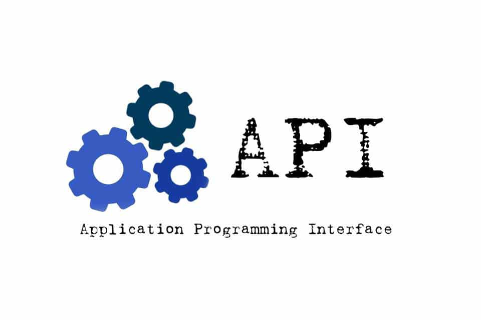

# Documentation 

Description of the project and company 

## Data Cleaning And  Recommendation System 

<!-- -->

[<em>Data cleaning</em>](./pages/dataclean.md)
[<em>Recommender  System</em>](./pages/recommendersystem.md)
 

## Fast moving products Documentation   

[<em> Moving Product</em>](./pages/Moving_product_code_docs.md)
[<em>Moving Product API</em>](./pages/fast_moving_API.md)

## **Recommender System**

[<em> Content Based Recommender System</em>](./pages/rec_sys_contain_based.md)
[<em>Rec System API</em>](./pages/recommender_API.md)

## **API**

[<em>App API</em>](./pages/App_api.md)
[<em>Grade API</em>](./pages/Grad_API.md)

[<em> Recommender API</em>](./pages/recommender_API.md)
[<em>Moving Product API</em>](./pages/fast_moving_API.md)

## Flutter Documentation

## **Website Documentation**

[<em>Admin View Documentation</em>](./pages/website.md)
[<em>Customer View Documentation</em>](./pages/website_Customer.md)
 

## Test 3