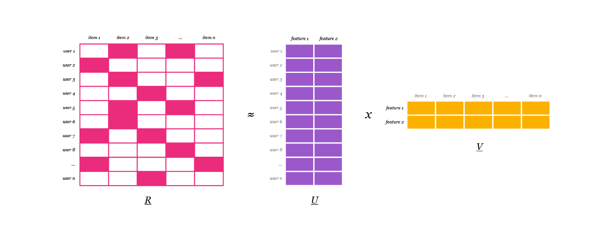

# **Recommender System**

Project description

This Project is implemented in two parts

* Select and train recommendation Models and save the models

* Create package for the costumers

## Selection and Training Model
 
For the Product Recommendation we Have selected ALS(Alternate least square) algorithm. Reason for sleeting the ALS Algorithm is explained bellow  

ALS recommender is a matrix factorization algorithm that uses Alternating Least Squares with Weighted-Lambda-Regularization (ALS-WR). It factors the user to item matrix A into the user-to-feature matrix U and the item-to-feature matrix M : It runs the ALS algorithm in a parallel fashion

Collaborative Filtering is the most common technique used when it comes to building intelligent recommender systems that can learn to give better recommendations as more information about users is collected.
Bellow We have used implementation of an implicit (more on that below) recommendation algorithm. We want to be able to find similar items and make recommendations for our users. Since we’re taking a collaborative filtering approach we will only be concern ourselves with items, users and what items a user has interacted with.

Implicit and explicit data type :

* **Explicit Data** : Explicit data is data where we have some sort of rating. Like the 1 to 5 ratings from the MovieLens or Netflix dataset. Here we know how much a user likes or dislikes an item which is great, but this data is hard to come by. Your users might not spend the time to rate items or your app might not work well with a rating approach in the first place.
* **Implicit Data** : Implicit data (the type of data we’re using here) is data we gather from the users behavior, with no ratings or specific actions needed. It could be what items a user purchased, how many times they played a song or watched a movie, how long they’ve spent reading a specific article etc. The upside is that we have a lot more of this data, the downside is that it’s more noisy and not always apparent what it means.

With star ratings we know that a 1 means the user did not like that item and a 5 that they really loved it. With song plays it might be that the user played a song and hated it, or loved it, or somewhere in-between. If they did not play a song it might be since they don’t like it or that they would love it if they just knew about. So instead we focus on what we know the user has consumed and the confidence we have in whether or not they like any given product. We can for example measure how often they brought the product and assume a higher confidence if they’ve brought to it 500 times vs. one time.

**Matrix factorization**

The idea is basically to take a large (or potentially huge) matrix and factor it into some smaller representation of the original matrix. You can think of it in the same way as we would take a large number and factor it into two much smaller primes. We end up with two or more lower dimensional matrices whose product equals the original one.[Check this link for detail implementation of matrix factorization and AlS](https://medium.com/radon-dev/als-implicit-collaborative-filtering-5ed653ba39fe)

<!--| <em> | 
|:--:| 
| *Matrix Factorization* |
-->
|  |
|:--:|
| *Matrix Factorization* |

### **Data Training and preprocessing** : rec_system/model_training

rec_system/model_training Directory contains script for training  three models 

* **Group Recommendation Model** : Important columns are 'kunden-nr', 'Group' 

* **Brand Recommendation Model** : Important columns are 'kunden-nr', 'Hersteller'

* **Grade recommendation Model** : Important columns are 'kunden-nr', 'final_grade'

After training the model Save the model in .plk file.  

## Create package for the costumers
  
## **rec_system/src**

Explore the source code in following section bellow

## **Generate Score**

~~~python
from src import GenerateScore
~~~

## **Class:** GenerateScore()

This  class is useful for generating recommendation score according to customer and recommendation category (Group, Brand, Grade)

To create recommendation score need to import following data

1. Product data
2. Recommendation Model for Group
3. Recommendation Model for Brand
4. Recommendation Model fro Grade  

* Note:

  * Recommendation  models are pre-trained and saved in "saved   models" dir

  *

This class also include following private methods

* __create_group_recommendation():

* __create_brand_recommendation():

* __create_grade_recommendation():

These private methods returns the dataframe with recommendation score for given customer (for group, brand and grad respectively)

After generating recommendation scores for customer :

* __add_score_to_table():

This private method is used to add all scores and produce average of those score as final recommendation of the score of the product to customer selected (or given)

### adde_score_for_one_customer

This function is useful to add score to supply products (products in warehouse) w.r.t. customer number.
Product recommendation models are already trained and save in Saved model directory.

Args:

>supply_df[DataFrame] : products list in warehouse important column ["Group", "brand_name", "final_grade"] 

>import_model_group[Any] : pre-trained recommendation model for group

>import_model_brand[Any] : pre-trained recommendation model for brand 

>import_model_grade[Any] : pre-trained recommendation model for grade 

>cust_nr[int] : customer number  

Returns:

>DataFrame: Returns with  score added Dataframe important columns ['Score']  

Usage:

~~~python
# product data (products in warehouse available for sale)with Added recommendation score for customer    
product_data = adde_score_for_one_customer(supply_df, import_model_group, import_model_brand, import_model_grade, cust_nr )
~~~

## **Add score**

## **Class:** AddScore()

This class is useful to add recommendation score to supply dataframe  

Args:
>GenerateScore ([class]): this class is useful to generate  and add recommendation score to dataframe according customer

### get_score_added_df

This function useful to to add the recommendation score to product supply list and return dataframe

Args:

>supply_df ([dataframe]): supply dataframe 

>cust_nr ([int]): customer number

Returns:
>[DataFrame]: Recommendation score added DataFrame

## **Create Package**

## **Class:** CreatePackage()

This  class is useful to create package after the adding recommendation score score to the product according to customer

This class is inherited from AddScore() class

~~~py
from src import CreatePackage 
~~~

Args:

>AddScore ([Class]): [description]

This class also contains following private method

* __get_products_by_category():
* __save_to_excel():

These function is useful to select product quantity( no of products) according to  group and saving the dataframe to excel file

### assemble_package_one_customer

This function is useful to create package recommendation for given customer

Args:
>supply_df ([DataFrame]): supply_df with score added wrt customer

>package_info ([DataFrame]): package info dataframe

>group_list ([list]): list of product groups 

>customer_nr (int, optional): description. Defaults to 70151.

Returns:
>DataFrame : Returns recommended package for customer  

Usage:

~~~python
# recommended package for customer 

package_for_customer =  assemble_package_one_customer(supply_df, package_info, group_list, customer_nr)

~~~

### reload_supply_dataframae

Args:
>recommended_package([DataFrame]): Recommended package dataframe for customer
>supply_df_without_score ([DataFrame]): supply data

Returns:
>DataFrame: supply dataframe with deleted product  which are already recommended to customer( remaining products after creating package)

Usage:

~~~python
# remaining product after after creating package 
remaining_product = reload_supply_dataframae(recommended_package, supply_df_without_score)

~~~

### assemble_package_by_costomer_list_without_df_reload

Create Package for list of customer without deleting recommended packages for costumers

Args:
>supply_df ([DataFrame]): supply_df with score added wrt customer

>package_info ([DataFrame]): package info dataframe

>group_list ([list]): list of product groups 

>cust_list ([list]): list of customers

Returns:
>save packages created to excel files

~~~python
# package created and saved in excel file ()
packages_saved = assemble_package_by_costomer_list_without_df_reload(supply_df, package_info, group_list, cust_list)
~~~

### assemble_package_by_costomer_list_df_reload

Create Package for list of customer with deleting recommended packages for costumers

Args:
>supply_df ([DataFrame]): supply_df with score added wrt customer

>package_info ([DataFrame]): package info dataframe

>group_list ([list]): list of product groups 

>cust_list ([list]): list of customers

Returns:
>save packages created to excel files

~~~python
# package created and saved in excel file ()
packages_saved = assemble_package_by_costomer_list_df_reload(supply_df, package_info, group_list, cust_list)
~~~

## **Similar Product**

## **Class:** SimilarItems() 

## **main.py**

Main file contains customer list for creating package 

Import supply data and select following columns
>["lager_number", "brand_name", "Group", "final_grade"]

This file contains group_list constant (). This constant is contain all the product category (16).

Customer list:  is list of costumers which package is to be created

Use the **assemble_package_by_costomer_list_df_reload()** from *CreatePackage* class to assembled package for given list of customers
