# **Website Documentation**

The Admin Panel is the backend of your website that enables you to add, delete,
update, edit, or modify your website whenever needed. It is an essential requirement for web applications.

Website contains Admin Panel and Customer panel. Admin Panel is accessed by  Admin(Developer), Sales  person and  Warehouse Manager. These above user will have the different access rights according to their functions. And customer panel will be accessed by customers. Admin Panel will have following functions according to user access rights these function can be used for different purposes. Admin Panel contains all the information about the products in warehouse and active and ordered packages.

---
---

## **Navigation Section**

In the left column, the navigation section of the Content Management System is allowing you to access the all view structure  available for user. And it also provide quick access to all menu.  

## **Content Section**

In the right column, all the objects which you select via the navigation column will be displayed.

---
---

## **Language Selection**

Businesses that offer customers a choice of multiple languages on their website have a real competitive advantage.

A multilingual website is the most cost-effective  and reliable way of engaging customers who speak another language.

Customers that can read content in their native language are more likely  to purchase from your website.Customers who can understand your content in their language are more
likely to tell like-minded people creating familiarity and repeat business. In fact, 46% of website users agreed that if the information was in their native language
it provided trust and confidence in the product making them more likely to buy the product.
Translating your website into multiple languages is an excellent starting point
to increase your company’s global presence.

### Steps to Select language

As shown bellow

* By pressing user detail button ((in red rectangle) (Top Left corner)) use can select Language from list

* (For the future iteration language will have separate Button)

---
---

## **Dashboard**

Dashboard  contains all brief overview of the operation. Dashboard view contains information about total clients, total active products in warehouse, total packages created active and sold, pending orders and total order completed orders.

Dashboard also gives direct access to the client, active product's and completed order functions.
*Dashboard can be accessed by all the the user with admin panel privileges eg. sales person, warehouse Manager,and admin*

---
---

## **Users**

The user profile is located at the top right corner of your browser window. Your user rights are automatically linked to your login. These are assigned by the system administrator and define the possible working steps that you are allowed to carry out in the system. The display of elements in the navigation and in the menu is also linked to the user rights. User rights can only be changed by the system administrator.

When you click on the user icon, the dialogue window appears where you can see the log out button. Here you can also change your *password by clicking on the context menu* and  here you can select language

Users View can be accessed only by user with Admin permission. User will have  active or not active status

* **Search Section**
  * There are multiple way to search user by simply searching First name , Last name , Email Id or By using user role  

* **Note**
  * Always log out correctly using the logout button. Do not simply close the window. Other persons with access to your workstation could continue to work within a certain time under your login in the CMS.

---
---

## **Client**

Customer View is useful  to add  new customers and check existing customers status. As user can see bellow  User can Also take action on customer such as edit customer info and delete customer.
Client View is accessed by user with admin and Sales permission.

### **Status**

* There  are two types of client status as follows  
  * **Active**
  * **Not Active**

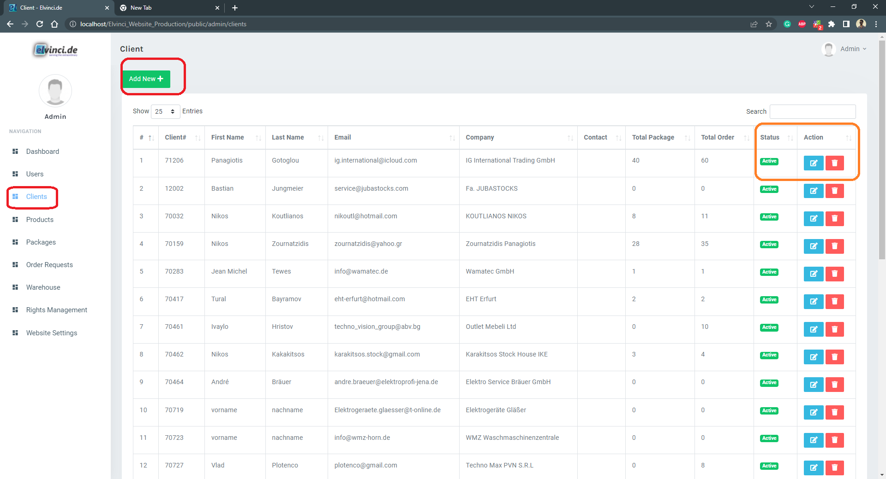

---
---

## **Products**

*User can easily add products just by entering Product titles, details, images.*
You can keep a track of single as well as multiple product inventories at one time and help your customers book those products which are ready for shipment.
Admin Dashboard helps in grouping your products to a specific category or brand.

* **Assigned Column** (*Blue Rectangle*)

    This columns is to check the product status in the warehouse is it available to add to the new package.

  * **Assigned :** \
    When the give product  is assigned to package or already in the the package or already sold to customer, It show following  three information about the product.  
    * **Assigned** (Greed Rectangle)
    * **Package Nr** (Blue Rectangle)
    * **Client** (Black rectangle)
  * **Unassigned :** \
    When product is not assigned to any package or not sold yet and it is available to sale. It shows unassigned in the in red rectangle.  

* **Ordered Column :** (*Black Rectangle*)\
    This colum provide information about the Assigned product is ordered or not Ordered.
  * **Ordered:**:  
    When product is ordered it shows following information in ordered column as shown in figure bellow
    * **Order** (Greed Rectangle)
    * **Order nr** (Blue Rectangle)
    * **Client** (Black rectangle)
  * **Not Ordered**

    Product can be assigned and not ordered or product can be not assigned and not ordered. Please see the figure bellow

### **Action**

* Following action can be taken on Products
  * **Edit** 

    * Sales person can edit the product info by pressing *Edit* button (shown above)
    * This option will take sales person to the next view as shown bellow and you can add and change product details as shown bellow.
    * You can add and delete new Images of the product

    ||
    |:-----------:|
    | *Edit Product Information* |

  * **Delete :**   
    * Delete button is useful to delete product from database
    * **Note :** \
        Product is deleted permanently from database (Be careful before deleting the product from this option )
  * **Product Detail** 
    * Product detail button is useful to check details of product grade, images and score for the product condition.

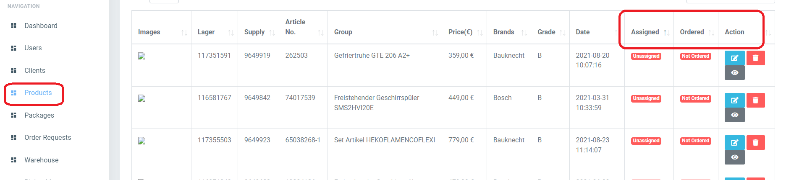

---
---

## **Package**

* The  Procedure  to creating package, sending  package and approving package and placing the order is explained bellow with flowchart  

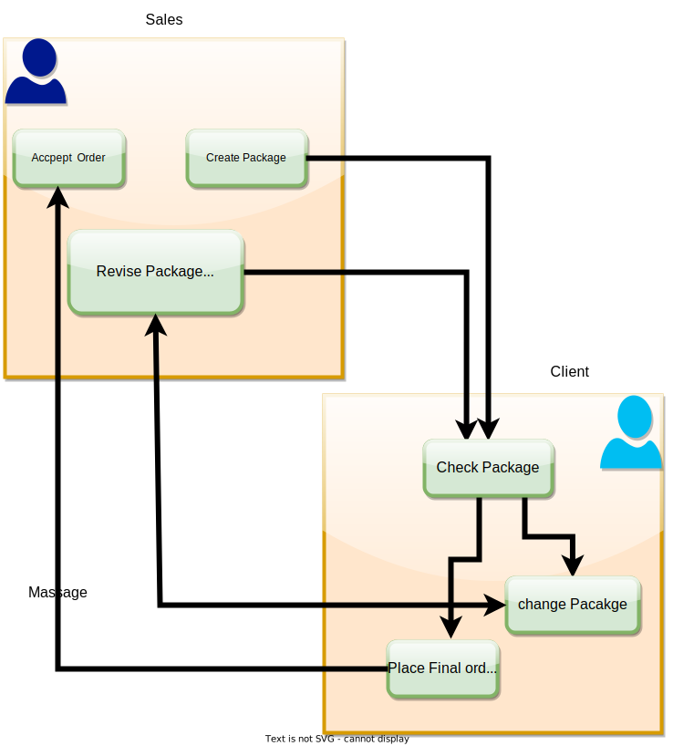

### **Status**

* Following Status are exist on package and there meaning
  * ***Pending***  
    * *Meaning* : Package has been created by sales person and sent to the customer
    * *Action*  
      * *Action 1*: Sales person can edit the package again Add more product to the package from same supply number and add products from different supply number
      * *Action 2*: Sale person can delete the package which is created before
    *  
  * ***Ordered***
    * *Meaning* : Customer has selected products from given packages and requested to place order
    * *Action* : Once the customer requested to place the order, It is not possible to place the order  

### **Action**

* Following action can be taken on the package
  * **Edit** 
    * If the customer has not placed order request yet Sales person can **Edit** the package, add products from same package and add products from different supply number.
  * **Delete** 
    * If the customer has not placed order request yet Sales person can **Delete** the package.
  * **No Action**
    * When customer placed order  request sales person can not take any action.  

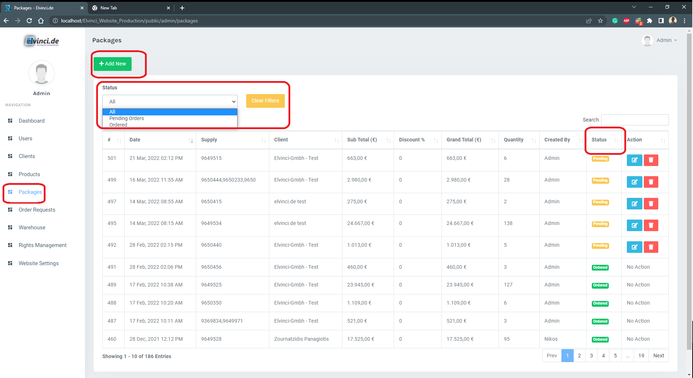

### **Step to Create package**

* Following steps are required to create package
  * **Select Warehouse :**
    * Select the warehouses from given list.
    * *Add more information about the warehouse*
  * **Select Supply Number**
    * Select the supply number according to meeting plan
    * Multiple Supply can be selected.
    * *Supply Number selection Conditions*
  * **Select Client**
    * Client can be selected using customer number or the Client(company name) name
  * Percentage of original price
    * Default value for the price for the product according to Product Grade is predetermine and selected.
    * Sales person can change this value according to requirement.
    * **Conditions**
  * **Select Products**
    * All Non-set products are  by-default selected.
    * Sales person need to unselect the product to remove product from package list.
    * Sales person can  filter according to Grade, Brand article number, Group and product description.
    * Set products needs to be paired with respective product group and article number
    * Set products will be in two three sets(can be seen in article_nr -1, -2 or -3), once all set are joined the all the product(two or three) will show the green circle on upper right corner of the product box as show bellow.
    * **Product Select Conditions**

        ||
        |:-----------:|
        | *Joining the Set Articles* |

  * **Press Create Package**
    * Once desired products(recommended products) added to the list user needs press create package button
    * After pressing Create package , it needs to conform that package contains at list 80% products from supply list.
    * Once all the above steps are completed and requirements are satisfied package will be sent to customer
    * And customer will be notified (Automatically)

  * **Problem User May face during the process**

  ||
  |:-----------:|
  | *Steps to Create Package* |

  ||
  |:-----------:|
  | *Create Package View* |

---
---

## **Order Request**

The Admin Panel not only helps you to manage and track all your orders but also check multiple products at once.Summary of the products ordered by your customer. Admin Panel helps you to directly create your draft orders.Keep a track of abandoned orders.

After package is sent to the customer, customer will select the products according to there requirement and request the order.

* As show bellow user can check the status of the order ( shown in Yellow rectangle)

### **Status**

* Following status and there meaning
  * **Pending :**
    * Order request has received from customer
    * Sales person can review the order request and take the action (Edit, Delete, Revert, Approve)
  * **Approved :**
  Order has been approved by the sales person and System will send automatic response to client
  * **Awaiting Approval :**
    * **meaning and Action needs to be taken**
  * **Approved Warehouse :**
    * **Meaning and**

Also user can take action on the package such as edit the package delete the package and export the package in excel for mat for the further.

### **Action**

* Following action can be  taken on the order request
  * **Download Image** ==> 
    * Sales person can download images of the products

  * **Export Excel** ==> 
    * Sales person can export the order details and download the details in excel format
  * **Edit** ==>
    * Edit the package (add and remove products from the package) (same the supply number)
  * **Revert**  ==> 
    * This Option will revert the package as it originally created and send it to the the customer for further steps
  * **Delete** ==> 
  * **Approve** ==> 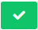
    * Once sales person is receive the order request(Pending). Sales person can approve the order
    * Once the order is approved Sales person can not make any changes in the order (no Delete, No Edit, No Revert)

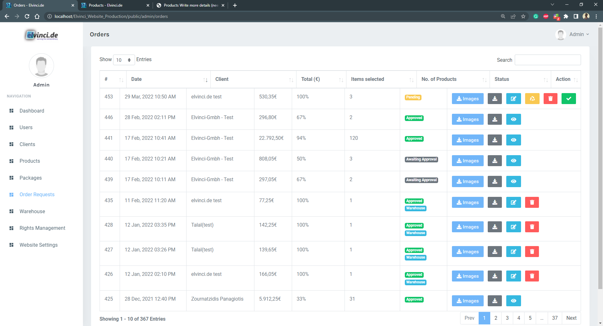

---
---

## **Warehouse**

In the warehouse view Sales person can check all the Pending Carts in the warehouse. Also sales person can direct create order for the customer from here

|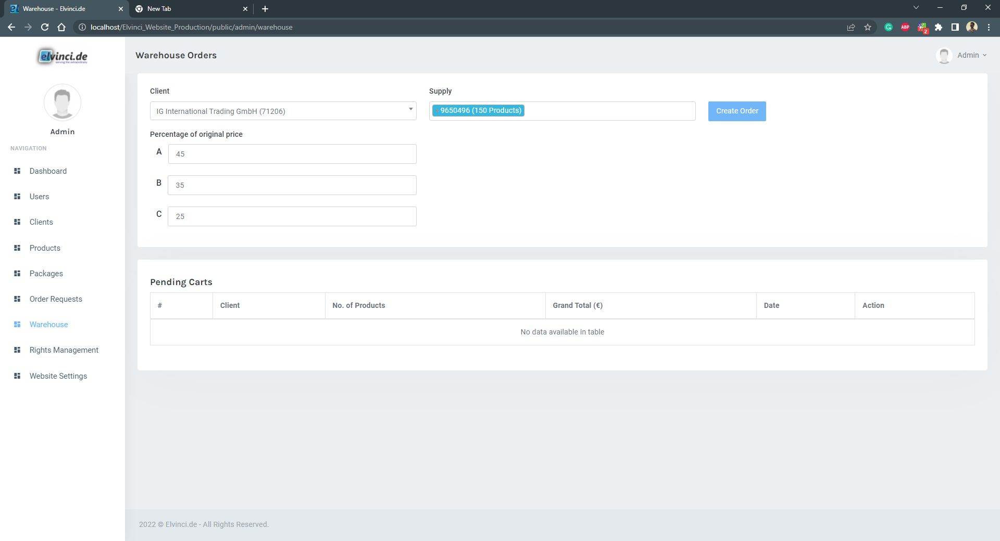|
|:----:|
|*Warehouse*|

### **Create Order** 

This option gives the sales person to create order directionally instead of creating package and waiting for client's approval. While creating order for  the customer sales person can either select the supply number and then select the products from that supply or Directly select the products from all the available products from warehouse. 
 
  |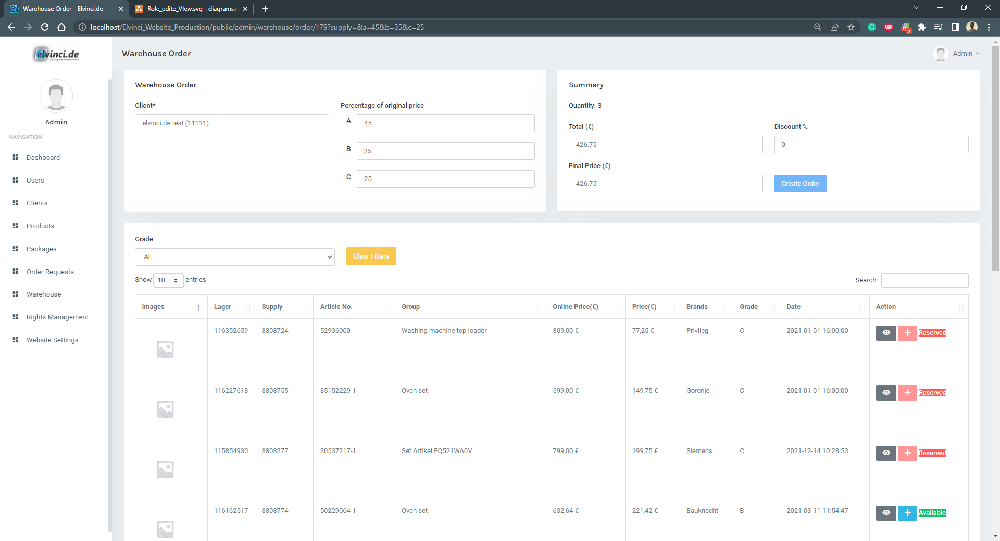|
  |:---:|
  | *Create Order* |

---
---

## **Right Management**

* This view is Accessed only by admin.
* Rights management is useful for adding and removing the access to the user Role (Admin, Sales, Warehouse Manager , Customer).  
* Admin can create new Role for specific purpose with specific access restrictions. 
* Admin Can Edit the existing Role and add or remove view access to the Role

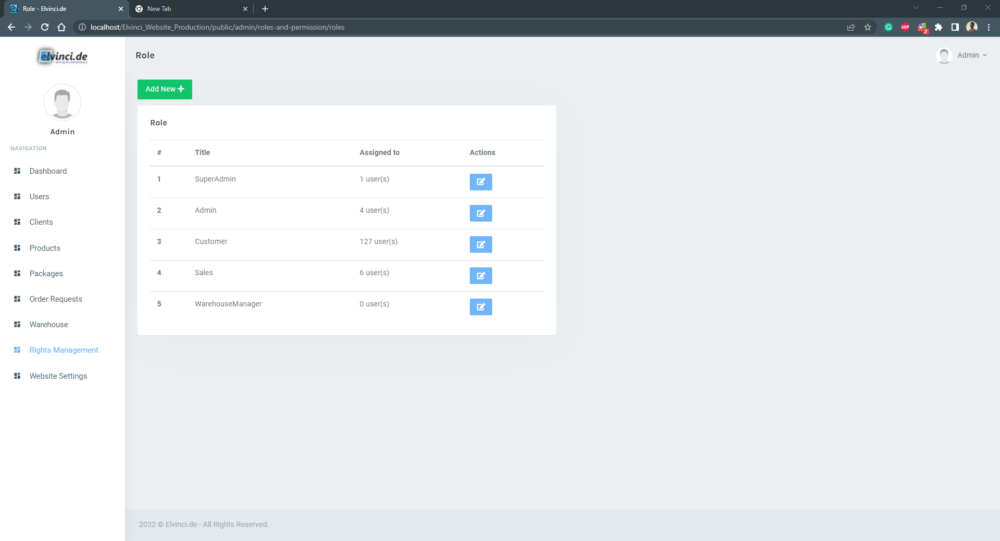

### **Add New Role**

* Admin can create new Role and Provide access according to specification as shown bellow. 

  |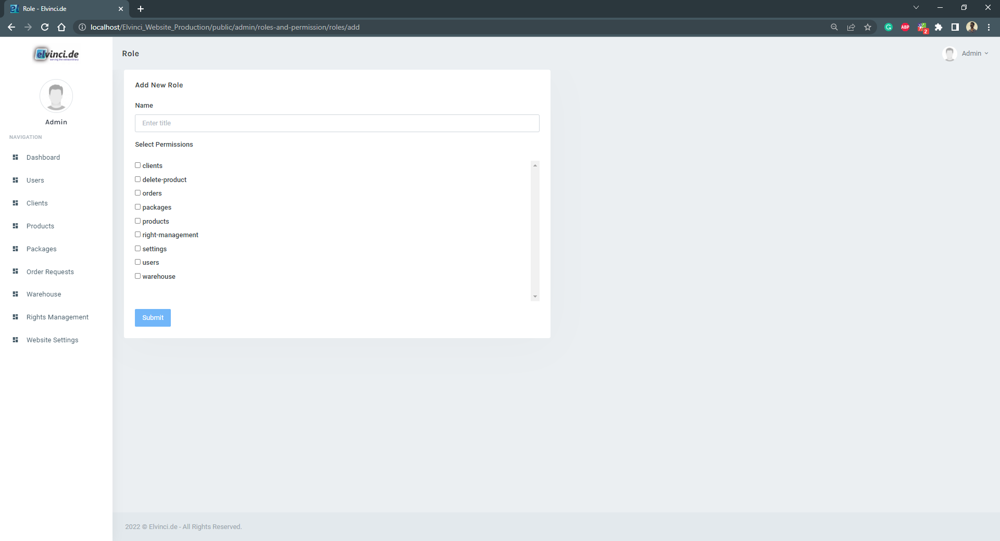|
  |:----:|
  | *Add New Role*|

### **Edit**

* Admin Can Edit the existing Roles In order to increase or decrease the accessibility of the Role. 
* Bellow example for sales person Role and customer Role is give

  ||
  |:----:|
  | *Edit Role*|

---

---

## **Website Setting**

* This View is accessed by admin 
* Admin can control the version of the website
* And most importantly Admin can control percent of the products(from selected supply) in package
* And Admin can decide the nr of days for old products     

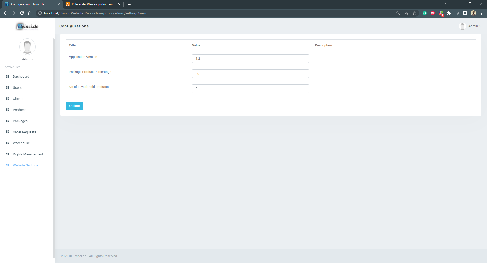