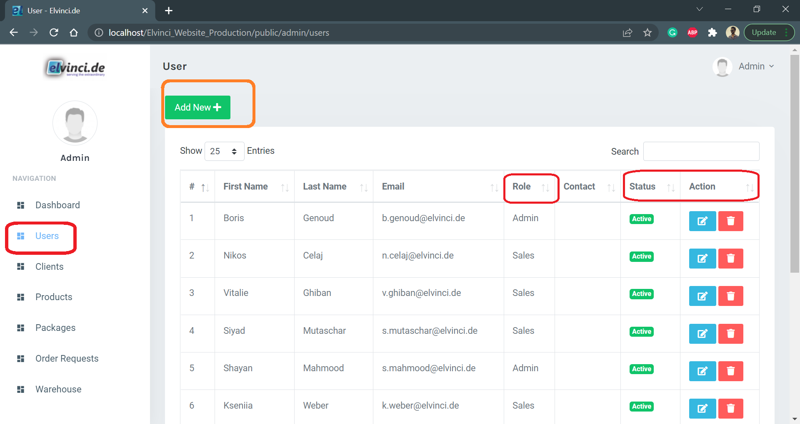

# **Website Documentation**

The Admin Panel is the backend of your website that enables you to add, delete,
update, edit, or modify your website whenever needed. It is an essential requirement for web applications.

Website contains Admin Panel and Customer panel. Admin Panel is accessed by  Admin(Developer), Sales  person and  Warehouse Manager. These above user will have the different access rights according to their functions. And customer panel will be accessed by customers. Admin Panel will have following functions according to user access rights these function can be used for different purposes. Admin Panel contains all the information about the products in warehouse and active and ordered packages.

## **Navigation Section**

In the left column, the navigation section of the Content Management System is allowing you to access the all view structure  available for user. And it also provide quick access to all menu.  

## **Content Section**

In the right column, all the objects which you select via the navigation column will be displayed.

## **Language Selection**

Businesses that offer customers a choice of multiple languages on their website have a real competitive advantage.

A multilingual website is the most cost-effective  and reliable way of engaging customers who speak another language.

Customers that can read content in their native language are more likely  to purchase from your website.Customers who can understand your content in their language are more
likely to tell like-minded people creating familiarity and repeat business. In fact, 46% of website users agreed that if the information was in their native language
it provided trust and confidence in the product making them more likely to buy the product.
Translating your website into multiple languages is an excellent starting point
to increase your company’s global presence.

### Steps to Select language

As shown bellow

* By pressing user detail button ((in red rectangle) (Top Left corner)) use can select Language from list

* (For the future iteration language will have separate Button)

## **Dashboard**

Dashboard  contains all brief overview of the operation. Dashboard view contains information about total clients, total active products in warehouse, total packages created active and sold, pending orders and total order completed orders.

Dashboard also gives direct access to the client, active product's and completed order functions.
*Dashboard can be accessed by all the the user with admin panel privileges eg. sales person, warehouse Manager,and admin*

## **Users**

The user profile is located at the top right corner of your browser window. Your user rights are automatically linked to your login. These are assigned by the system administrator and define the possible working steps that you are allowed to carry out in the system. The display of elements in the navigation and in the menu is also linked to the user rights. User rights can only be changed by the system administrator.

When you click on the user icon, the dialogue window appears where you can see the log out button. Here you can also change your *password by clicking on the context menu* and  here you can select language

Users View can be accessed only by user with Admin permission. User will have  active or not active status

* **Search Section**
  * There are multiple way to search user by simply searching First name , Last name , Email Id or By using user role  

* **Note**
  * Always log out correctly using the logout button. Do not simply close the window. Other persons with access to your workstation could continue to work within a certain time under your login in the CMS.

## **Client**

Customer View is useful  to add  new customers and check existing customers status. As user can see bellow  User can Also take action on customer such as edit customer info and delete customer.
Client View is accessed by user with admin and Sales permission.

Status Significance

* **Active**
* **Not Active**

## **Products** Write more details (need o ask questions)

*User can easily add products just by entering Product titles, details, images.*
You can keep a track of single as well as multiple product inventories at one time and help your customers book those products which are ready for shipment.
Admin Dashboard helps in grouping your products to a specific category or brand.

* **Assigned product** *Blue Rectangle*
  * **Assigned**
    * **Assigned**
    * **Package Nr** 
    * **Client**
  * **Unassigned**

* **Product Ordered** *Black Rectangle*
  * **Ordered**
    * **Order**
    * **Order nr**
    * **Client**
  * **Not Order Nr**

* **Action**
  * **Edit**  
  * **Delete**   
  * **Product Detail** 

## **Package** (need to ask question also need to answer condition details)

* Step involved in the creating package 
  * Select Warehouse
  * Select Supply Number
    * **Supply Number selection Conditions**
  * Select Client
  * Select Percentage of grad 
    * **Conditions**
  * Select Products
    * **Product Select Conditions**
  * Press Create Package
  * **Problem User May face during the process**

  

* Further Procedure creating package, sending  package and approving package and placing the order is explained bellow with flowchart  

* **Status and meaning**
  * Pending  
    * Add Details
  * Ordered
    * Add Details

* **Action**
  * **Edit** 
  * **Delete** 
  * **No Action** 

## **Order Request** (need to ask question also need to answer condition details)

The Admin Panel not only helps you to manage and track all your orders but also check multiple products at once.Summary of the products ordered by your customer. Admin Panel helps you to directly create your draft orders.Keep a track of abandoned orders.

* As show bellow user can check the status of the order ( shown in Yellow rectangle)
* **Status and its meaning**
  * **Approved**
  * **Awaiting Approval**
  * **Approved Warehouse**

* **Action**
  * **Download Image** ==> 
  * **Export Excel** ==> 
    * Details
  * **Edit** ==> 
  * **Revert**  ==> 
    * Revert Details 
  * **Delete** ==> 
  * **Approve** ==> 
    * Approve meaning 

* Also user can take action on the package such as edit the package delete the package and export the package in excel for mat for the further.
* Status and related action

## **Right Management**

