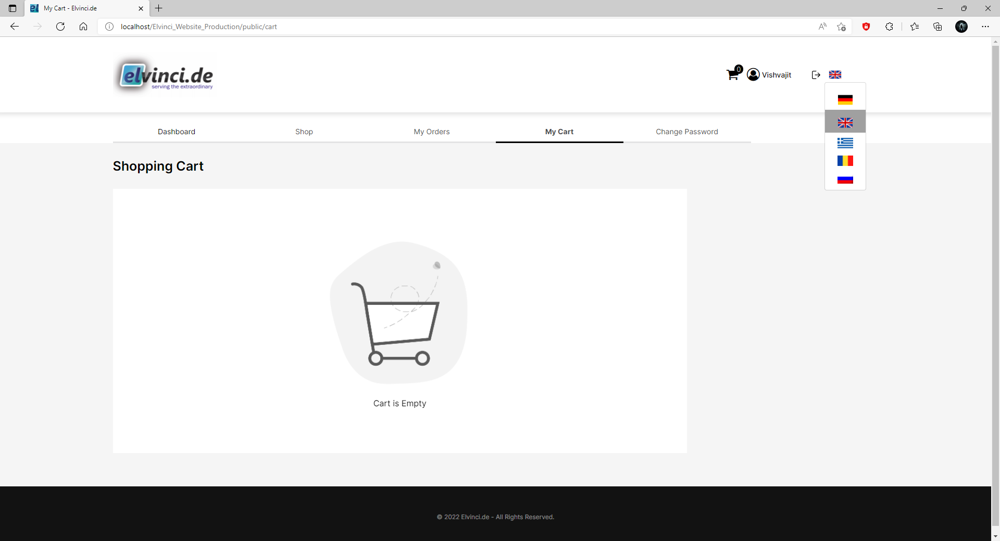
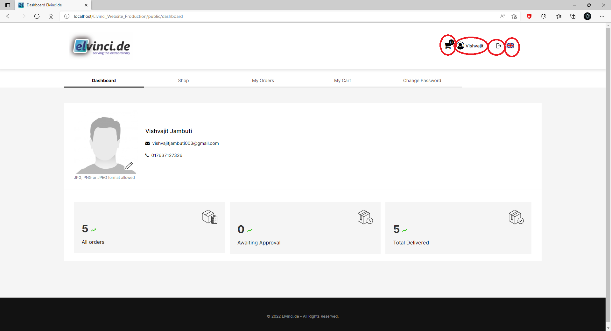
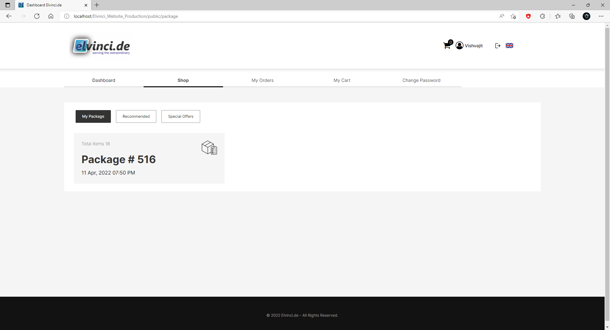
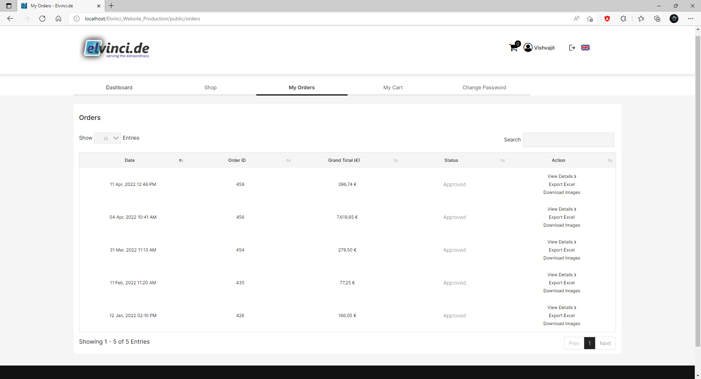
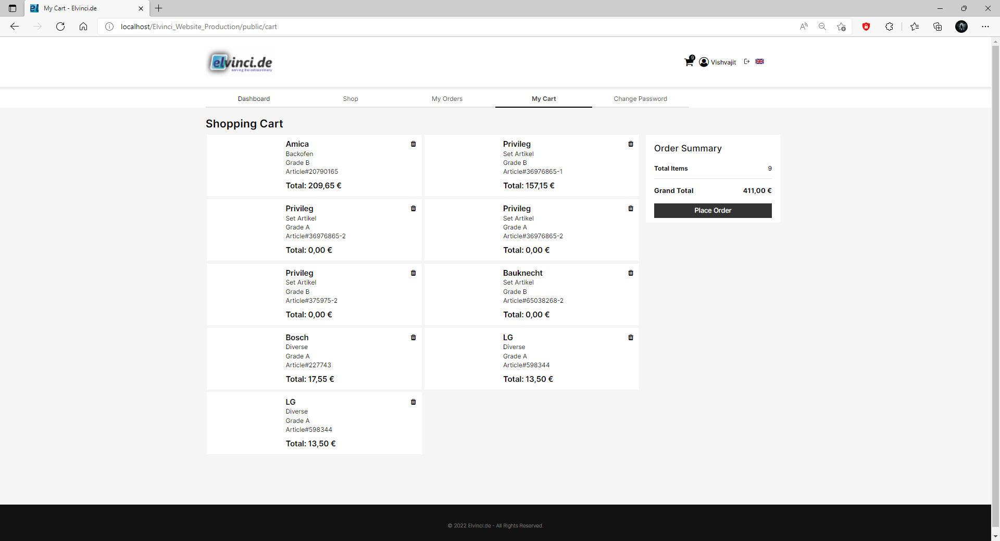

# **Website Customer View**

* After Logging in with client credential client can see following view. It contains dashboard and client profile as shown bellow. 

## **Language Selection**

As shown bellow

* By pressing user detail button ((in red rectangle) (Top Left corner)) use can select Language from list

## **Dashboard**

Dashboard contains following three options 

### **All Orders**

* All the order including approved and pending 

### **Awaiting Approval** 

* Requested order is under review and order has not yet accepted  

### **Total Delivered**

## **Shop**

In shop view client can see the current package created and sent to them. By clicking on the package client can see package in detail.   

### **My Package**

* When client opens the package client can see following view.
* All the products from packages are by default selected.
* Customer can remove the products from the list.
* Customer needs to select at list 80% of the product from package. 
* To place order client need to go to Cart

* 

### **Recommended**

### **Special Offer**

* Special offer products will be shown to client according the clients purchasing history 
* Special offer products will be  customized according to client  

## **My Order**

* Once the order is request client can see status of the order.
* **Pending**
  * Order request has sent to sales person.
* **Approved**
  * Order is accepted and read to pick up.

## **My Cart**

* Client can see the all products selected from package
* By pressing the place order button client can request to place order to sales person 
* Sales person  will review the order and Will either approve the order or send the rewised package again with added new products to client.   

## **Change Password**